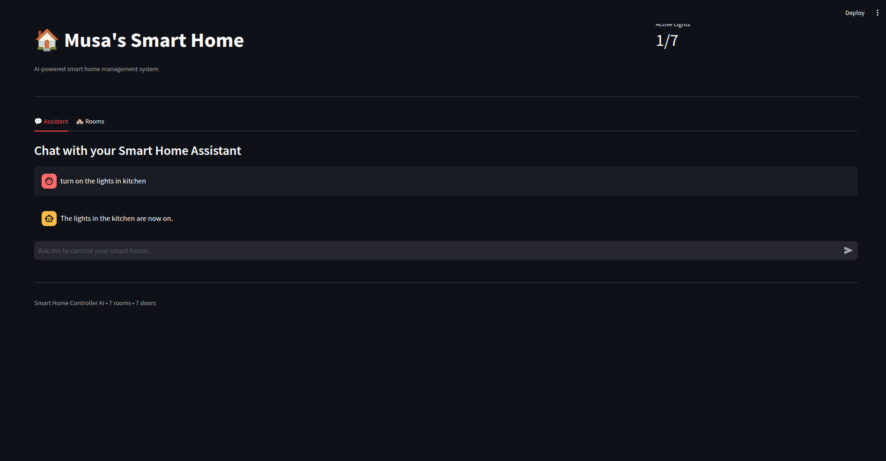
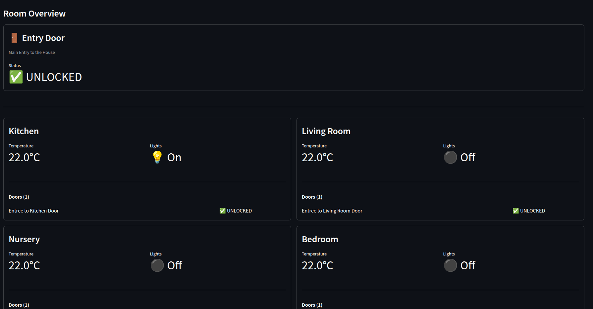

# 🏠 Smart Home Controller AI

A demonstration of the **Supervisor Pattern** in multi-agent AI systems using LangChain. This project showcases how a supervisor agent can intelligently coordinate specialized agents to manage smart home operations through natural language commands.

[](https://www.python.org/)
[](https://python.langchain.com/)
[](https://streamlit.io/)

## 📋 Overview

This demo implements a **hierarchical multi-agent architecture** where a supervisor agent routes user requests to specialized sub-agents:
- **Climate Agent**: Temperature control
- **Security Agent**: Door lock management  
- **Lighting Agent**: Lighting control

The supervisor analyzes natural language commands, determines which agent(s) to invoke, and coordinates their responses.

## 📸 Screenshots

### Chat Interface
Control your smart home using natural language commands. The assistant tab provides an interactive chat interface where you can send commands and receive instant feedback.



### Room Overview Dashboard
Monitor and manage all rooms at a glance. The Rooms tab displays real-time status of temperature, lighting, and door locks for each room in your smart home.



## 🏗️ Supervisor Pattern Architecture

```
                    ┌─────────────────┐
                    │  User Request   │
                    └────────┬────────┘
                             │
                             ▼
                  ┌──────────────────────┐
                  │  Supervisor Agent    │
                  │  (Analyzes & Routes) │
                  └──────────┬───────────┘
                             │
          ┌──────────────────┼──────────────────┐
          │                  │                  │
          ▼                  ▼                  ▼
    ┌──────────┐      ┌──────────┐      ┌──────────┐
    │ Climate  │      │ Security │      │ Lighting │
    │  Agent   │      │  Agent   │      │  Agent   │
    └──────────┘      └──────────┘      └──────────┘
```

**Key Pattern Benefits:**
- ✅ Separation of concerns - each agent handles specific domain
- ✅ Scalability - easy to add new specialized agents
- ✅ Maintainability - isolated agent logic
- ✅ Intelligent routing - supervisor decides which agent(s) to invoke

## 🔧 Prerequisites

- **Docker Desktop** or **Docker Engine** ([Install Docker](https://docs.docker.com/get-docker/))
- **Visual Studio Code** ([Download](https://code.visualstudio.com/))
- **Dev Containers Extension** ([Install from VS Code Marketplace](https://marketplace.visualstudio.com/items?itemName=ms-vscode-remote.remote-containers))
- **LLM Provider API Key** - OpenAI, Anthropic, Google Gemini, or others ([See all providers](https://docs.langchain.com/oss/python/integrations/providers/all_providers))

## 📦 Quick Start with Dev Containers

This project uses **Dev Containers** for a consistent development environment. The container includes Python 3.12, all dependencies, and required tools pre-configured.

### 1. Clone the Repository

```bash
git clone https://github.com/musabeytekin/smart-home-controller-ai.git
cd smart-home-controller-ai
```

### 2. Configure Environment Variables

Copy the example environment file and add your API key:

```bash
cp .devcontainer/env.example .devcontainer/.env
```

Edit `.devcontainer/.env` and set your **LLM provider API key**:

```bash
# LLM Provider API Key (at least one required)
# See: https://docs.langchain.com/oss/python/integrations/providers/all_providers
OPENAI_API_KEY=your_openai_api_key_here
# ANTHROPIC_API_KEY=your_anthropic_api_key_here
# GOOGLE_API_KEY=your_google_api_key_here

# Optional - Git configuration (for version control inside container)
GIT_USER=your_github_username
GIT_EMAIL=your_email@example.com
GIT_REMOTE=https://github.com/yourusername/yourrepo.git
GIT_TOKEN=your_github_token
```

**Note:** The project uses OpenAI by default. If you want to use a different provider, you'll need to modify `src/core/chat_model.py` accordingly.

### 3. Open in Dev Container

1. Open the project folder in **VS Code**
2. VS Code will detect the dev container configuration
3. Click **"Reopen in Container"** when prompted (or use Command Palette: `Dev Containers: Reopen in Container`)
4. Wait for the container to build and setup to complete

The setup script will:
- ✅ Install all Python dependencies from `requirements.txt`
- ✅ Configure Git (if credentials provided)
- ✅ Set up the development environment

### 4. Run the Application

Once inside the dev container, you can run the application:

**Web Interface:**
```bash
streamlit run src/app.py
```

**CLI Interface:**
```bash
python src/main.py
```

## 💬 Example Commands

Try these natural language commands to see the supervisor pattern in action:

```
"Turn on all lights"
"Set temperature to 22 degrees in the kitchen"
"Lock all doors"
"Turn off lights in bedroom and nursery"
"What's the temperature in the living room?"
"Unlock the entry door and turn on the lights"
```

The supervisor agent will:
1. Analyze your request
2. Determine which specialized agent(s) to call
3. Execute the appropriate tools
4. Return a coordinated response

## 🤖 Agent Details

### Supervisor Agent
- **Role**: Request orchestrator
- **Tools**: Routes to Climate, Security, and Lighting agents
- **Capabilities**: Multi-agent coordination, complex task decomposition

### Climate Agent
- **Domain**: Temperature control
- **Tools**: Set temperature, increase/decrease temperature, get current temperature

### Security Agent  
- **Domain**: Access control
- **Tools**: Lock/unlock doors (entry, specific doors, all doors)

### Lighting Agent
- **Domain**: Lighting control
- **Tools**: Turn on/off lights (all, specific rooms)

## 🛠️ Customization

**Change LLM Provider** (`src/core/chat_model.py`):

The project uses OpenAI by default, but you can easily switch to other LLM providers like Anthropic Claude, Google Gemini, Azure OpenAI, and more.

See all available providers and setup instructions: [LangChain Providers Documentation](https://docs.langchain.com/oss/python/integrations/providers/all_providers)

**Modify House Layout** 

(`src/core/house_data_provider.py`):
Add/remove rooms, doors, and initial states to customize the demo environment.

## 📚 Learn More

This demo illustrates key concepts in multi-agent systems:
- **Agent Specialization**: Domain-specific agents with focused responsibilities
- **Hierarchical Coordination**: Supervisor pattern for intelligent routing
- **Tool-based Architecture**: LangChain tools for agent capabilities
- **State Management**: Shared state across multiple agents

## Author

**Musa Beytekin**
- GitHub: [@musabeytekin](https://github.com/musabeytekin)

---

<div align="center">
  <strong>A demonstration of the Supervisor Pattern using LangChain</strong>
  <br>
  <sub>⭐ Star this repo if you find it useful!</sub>
</div>

